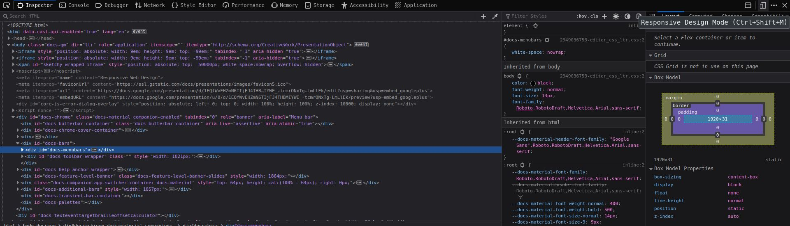

# Asynchronous Javascript

## **Async - Await**
Async adalah sebuah syntax dalam javascript yang menjadikan sebuah fungsi yang kita buat mengembalikan sebuah promise. contohnya :
 ```javascript
    async function getData() {
        return 1;
    }
    getData().then(console.log); // 1
```
Kita bisa melihat bahwa fungsi getData mengembalikan sebuah promise yang mengembalikan nilai 1. Nilai 1 dianggap sebagai nilai resolve, kita juga bisa menulisnya dengan lebih jelas sebagai berikut :
```javascript
    async function getData() {
        return Promise.resolve(1);
    }
    getData().then(console.log); // 1
```
Await adalah sebuah syntax yang digunakan untuk menunggu sebuah promise selesai dijalankan. contohnya :
```javascript
    async function getData() {
        return 1;
    }
    async function main() {
        const data = await getData();
        console.log(data);
    }
    main(); // 1
```

## Fetch
Fetch adalah sebuah Native Web API yang digunakan untuk melakukan HTTP calls dari externall network. contohnya :
```javascript
    fetch('https://jsonplaceholder.typicode.com/todos/1')
        .then(response => response.json())
        .then(json => console.log(json));
```
fetch() memiliki parameter utama yaitu URL/endpoint API, dan parameter kedua yaitu options, options ini berisi method, headers dan body. contohnya :
```javascript
    fetch('https://jsonplaceholder.typicode.com/todos/1', {
        method: 'POST',
        headers: {
            'Content-Type': 'application/json'
        },
        body: JSON.stringify({
            title: 'foo',
            body: 'bar',
            userId: 1
        })
    })
        .then(response => response.json())
        .then(json => console.log(json));
```
Kita juga bisa menggabungkannya dengan async await, contohnya :
```javascript
    async function getData() {
        const response = await fetch('https://jsonplaceholder.typicode.com/todos/1');
        const json = await response.json();
        console.log(json);
    }
    getData();
```
# Git dan Github Lanjutan

# Responsive Web Design
Responsive Web Design adalah sebuah teknik yang digunakan untuk membuat sebuah website yang dapat menyesuaikan dengan ukuran layar yang digunakan. Kita dapat melihat apakah website kita responsive atau tidak dengan menggunakan developer tools pada browser. contohnya :



atau dengan menekan kombinasi tombol Ctrl + Shift + M pada keyboard.
Untuk menerapkan responsive web design pada website kita, pertama-tama kita harus menambahkan viewport pada tag head. contohnya :
```html
    <meta name="viewport" content="width=device-width, initial-scale=1.0">
```

Lalu kita dapat mengatur resposivitas dari suatu elemen dengan menggunakan property max-width dan min-width. contohnya :
```css
    .container {
        max-width: 100%;
        min-width: 300px;
    }
```
Kita juga dapat mengatur resposivitas dari suatu elemen dengan menggunakan property media query. penerapan media query juga dibagi menjadi 2, yaitu dengan menggunakan file css yang berbeda untuk setiap media query, dan dengan menggunakan media query pada file css yang sama. contohnya :
```html
    <link rel="stylesheet" href="style.css">
    <link rel="stylesheet" media="screen and (max-width: 600px)" href="style-mobile.css">
```
```css
    /* file css yang berbeda */
    @media screen and (max-width: 600px) {
        .container {
            max-width: 300px;
        }
    }
```
```css
    /* file css yang sama */
    .container {
        max-width: 100%;
    }
    @media screen and (max-width: 600px) {
        .container {
            max-width: 300px;
        }
    }
```

## Breakpoints
Breakpoints adalah ukuran layar yang digunakan untuk menentukan resposivitas dari suatu elemen. contohnya :
```css
    @media screen and (max-width: 600px) {
        .container {
            max-width: 300px;
        }
    }
    @media screen and (min-width: 601px) and (max-width: 900px) {
        .container {
            max-width: 600px;
        }
    }
    @media screen and (min-width: 901px) {
        .container {
            max-width: 900px;
        }
    }
```
dari CSS tersebut kita dapat melihat bahwa elemen dengan class container akan memiliki max-width 300px jika ukuran layar kurang dari 600px, max-width 600px jika ukuran layar lebih dari 600px dan kurang dari 900px, dan max-width 900px jika ukuran layar lebih dari 900px. Artinya kita memiliki 3 breakpoints, yaitu dibawah 600px, antara 600px dan 900px, dan diatas 900px.

# **Bootstrap**
Bootstrap adalah sebuah framework CSS yang digunakan untuk mempermudah kita dalam membuat website yang responsive. Untuk menggunakan bootstrap, pertama-tama kita harus menambahkan link bootstrap pada tag head. contohnya :
```html
    <link rel="stylesheet" href="https://stackpath.bootstrapcdn.com/bootstrap/4.5.2/css/bootstrap.min.css" integrity="sha384-JcKb8q3iqJ61gNV9KGb8thSsNjpSL0n8PARn9HuZOnIxN0hoP+VmmDGMN5t9UJ0Z" crossorigin="anonymous">
```
Kita juga dapat menggunakan bootstrap dengan menggunakan menambahkannya secara lokal. contohnya :
```html
    <link rel="stylesheet" href="css/bootstrap.min.css">
```

## Grid System
Grid system adalah sebuah sistem yang digunakan untuk mengatur posisi elemen pada website. Grid system ini terdiri dari 12 kolom, dan kita dapat mengatur posisi elemen dengan menggunakan class-class yang sudah disediakan oleh bootstrap. contohnya :
```html
    <div class="container">
        <div class="row">
            <div class="col-12 col-md-6 col-lg-4">
                <div class="card">
                    <div class="card-body">
                        <h5 class="card-title
                        ">Card title</h5>
                        <p class="card-text">Some quick example text to build on the card title and make up the bulk of the card's content.</p>
                        <a href="#" class="btn btn-primary">Go somewhere</a>
                    </div>
                </div>
            </div>
            <div class="col-12 col-md-6 col-lg-4">
                <div class="card">
                    <div class="card-body">
                        <h5 class="card-title
                        ">Card title</h5>
                        <p class="card-text">Some quick example text to build on the card title and make up the bulk of the card's content.</p>
                        <a href="#" class="btn btn-primary">Go somewhere</a>
                    </div>
                </div>
            </div>
        </div>
    </div>
```
dari kode tersebut kita dapat melihat bahwa elemen dengan class card akan memiliki sebesar 12 kolom jika ukuran layar kurang dari 576px, 6 kolom jika ukuran layar lebih dari 576px dan kurang dari 768px, dan 4 kolom jika ukuran layar lebih dari 768px. Artinya kita memiliki 3 breakpoints, yaitu dibawah 576px, antara 576px dan 768px, dan diatas 768px.

## Components
Bootstrap juga menyediakan beberapa komponen yang dapat kita gunakan untuk mempermudah kita dalam membuat website. Untuk menggunakannya kita cukup menambahkan class pada element html yang kita miliki. contohnya :
```html
    <button type="button" class="btn btn-primary">Primary</button>
    <button type="button" class="btn btn-secondary">Secondary</button>
    <button type="button" class="btn btn-success">Success</button>
    <button type="button" class="btn btn-danger">Danger</button>
    <button type="button" class="btn btn-warning">Warning</button>
    <button type="button" class="btn btn-info">Info</button>
    <button type="button" class="btn btn-light">Light</button>
    <button type="button" class="btn btn-dark">Dark</button>
    <button type="button" class="btn btn-link">Link</button>
```
dengan begitu maka kita akan mendapatkan button dengan warna yang berbeda-beda. Begitu juga dengan elemen yang lain.
