# Pengenalan Command Line Interface (CLI)

## **Shell**

Shell adalah sebuah program yang digunakan untuk berkomunikasi atau memerintah sistem didalam komputer kita. Shell juga merupakan salah satu cara kita untuk berkomunikasi dengan sistem operasi. Beberapa jenis shell yaitu :

- Bourne Shell (sh)
- C Shell (csh)
- Bourne Again Shell (bash) 

## **Command Line Interface**

Command Line Interface adalah sebuah program shell yang berbasis teks. CLI memungkinkan kita untuk mengetikkan suatu perintah yang akan dijalankan oleh sistem operasi yang kita miliki.

## **Terminal Emulator**

Terminal emulator adalah salah satu contoh command line interface yang ada di komputer kita. Beberapa terminal yang biasanya digunakan yaitu :

- Command Prompt
- Terminal
- Git Bash
- Powershell

## **File System Structure**

Filesystem atau yang biasa disebut *fs* adalah sebuah metode yang digunakan oleh sistem operasi untuk mengatur bagaimana data akan disimpan dan diambil. Sistem operasi menyimpan data yang kita miliki dengan struktur seperti pohon. Sistem operasi Windows dan UNIX-like memiliki sedikit perbedaan dari segi struktur dalam menyusun data yang kita miliki. UNIX-like hanya memiliki satu cabang utama (root), sedangkan windows terdiri dari beberapa cabang utama (C, D, dan sebagainya).

## **Contoh Command**

- pwd (print working directory)\
Merupakan sebuah command untuk menampilkan direktori yang aktif saat ini
- ls (list)\
Merupakan sebuah perintah untuk menampilkan isi dari sebuah direktori
- cd (change directory)\
Merupakann sebuah perintah untuk berpindah dari direktori yang aktif saat ini ke direktori lain
- head\
Merupakan sebuah perintah untuk melihat beberapa baris awal dari sebuah file
- tail\
Merupakan sebuah command untuk melihat beberapa baris terakhir dari sebuah file
- cat\
Merupakan sebuah command untuk menampilkan isi dari suatu file
- touch\
Merupakan sebuah perintah untuk membuat file baru
- mkdir (make directory)\
Merupakan sebuah perintah untuk membuat directory baru
- cp (copy)\
Merupakan sebuah perintah untuk menyalin file ke sebuah directory
- mv (move)\
Merupakan sebuah perintah untuk memindahkan suatu file ke sebuah directory (dapat juga digunakan untuk melakukan rename terhadap sebuah file)
- rm (remove)
Merupakan sebuah perintah untuk menghapus sebuah directory maupun file<br><br>

# Dasar Git dan Github

## **Git**

Git merupakan sebuah version control system (vcs). Dengan menggunakan git kita dapat melakukan pelacakan perubahan dari file yang kita miliki, sehingga nantinya akan lebih memudahkan kita dalam manajemen file yang kita miliki.

## **Github**

Github merupakan salah satu platform penyedia layanan version controlling berbasis git yang dapat kita akses secara gratis.

## **Manfaat Penggunaan Git dan Github**

Salah satu manfaat utama dari penggunaan git dan github adalah memudahkan kita dalam kolaborasi. Sebuah tim dapat mengerjakan projek yang sama secara paralel tanpa harus saling menunggu berkat adanya metode branching pada version control system.

## **Alur Kerja Git**
- Inisiasi directory git
- Jika ingin menghubungkan git ke github maka sambungkan lewat perintah git remote
- Lakukan perubahan yang diinginkan pada file maupun folder tersebut
- Tambahkan file yang telah di ubah kedalam fase staging yang bertujuan untuk melakukan tracking perubahan pada file tersebut
- lakukan commit untuk menyimpan perubahan yang telah dilakukan secara local di komputer kita
- lakukan push agar perubahan yang ada di local juga terjadi di directory yang berada di github

## **Command Untuk Penggunaan Git**

- git init\
Merupakan command untuk melakukan inisiasi git pada suatu directory

    ```
    git init
    ```
- git remote\
    merupakan sebuah command yang berhubungan dengan remote directory yang ada di github. Untuk menyambungkan antara local directory dengan remote directory yang ada di github, maka bisa digunakan perintah git remote add

    ```
    git remote add <name> <url-github>
    ```
    dimana name adalah nama yang ingin kita gunakan untuk menamai url tersebut, dan url adalah url dari directory yang berada di github
- git add\
    Merupakan sebuah perintah untuk menambahkan file ke dalam fase staging
    ```
    git add <path>
    ```
    dimana path adalah path dari file atau folder yang ingin di tambahkan ke dalam fase staging
- git commit\
    Merupakan sebuah perintah untuk menyimpan perubahan yang ada di local directory
    ```
    git commit -m "<message>"
    ```
    dimana message adalah pesan yang ingin kita tambahkan untuk memberikan keterangan terhadap perubahan yang kita lakukan

- git push\
    Merupakan sebuah perintah untuk mengirimkan perubahan yang ada di local directory ke remote directory yang ada di github
    ```
    git push <name> <branch>
    ```
    dimana name adalah nama yang kita gunakan untuk menyambungkan antara local directory dengan remote directory yang ada di github, dan branch adalah nama branch yang ingin kita gunakan untuk mengirimkan perubahan yang ada di local directory ke remote directory

- git branch\
    Merupakan sebuah perintah untuk melihat branch yang ada di local directory
    ```
    git branch
    ```
    untuk membuat branch baru, maka bisa digunakan perintah git branch \<name>
    ```
    git branch <name>
    ```
    dimana name adalah nama branch yang ingin kita buat

- git checkout\
    Merupakan sebuah perintah untuk berpindah dari branch yang aktif saat ini ke branch lain
    ```
    git checkout <name>
    ```
    dimana name adalah nama branch yang ingin kita gunakan

- git pull\
    Merupakan sebuah perintah untuk mengambil perubahan yang ada di remote directory ke local directory
    ```
    git pull <name> <branch>
    ```
    dimana name adalah nama yang kita gunakan untuk menyambungkan antara local directory dengan remote directory yang ada di github, dan branch adalah nama branch yang ingin kita gunakan untuk mengambil perubahan yang ada di remote directory ke local directory

- git clone\
    Merupakan sebuah perintah untuk mengambil remote directory yang ada di github ke local directory
    ```
    git clone <url>
    ```
    dimana url adalah url dari directory yang berada di github<br><br>

# Dasar HTML

## **HTML**

HTML merupakan sebuah bahasa markup yang digunakan untuk membuat sebuah halaman web. HTML sendiri merupakan singkatan dari *Hyper Text Markup Language*. Pada web development, HTML digunakan untuk membuat struktur dari sebuah halaman web. Secara sederhana, HTML digunakan untuk menampilkan konten yang ingin kita tampilkan pada sebuah halaman web. Konten yang dapat ditampilkan pada sebuah halaman web antara lain text, gambar, video, link, dan lain sebagainya. HTML bersifat statis yang artinya konten yang ditampilkan pada sebuah halaman web tidak akan berubah kecuali kita melakukan perubahan pada file HTML tersebut.

## **Tools Pendukung**

Untuk menampilkan hasil dari file HTML tersebut, kita dapat menggunakan browser. Salah satu browser yang paling sering digunakan untuk menampilkan hasil dari file HTML adalah browser Google Chrome. Untuk mengedit file HTML, kita dapat menggunakan text editor. Salah satu text editor yang paling sering digunakan untuk mengedit file HTML adalah Visual Studio Code.

## **Struktur Dasar HTML**

Untuk membuat sebuah file html sederhana, kita dapat menggunakan struktur dasar HTML sebagai berikut:

```html
<!DOCTYPE html>
<html>
    <head>
        <title>Ini Judul</title>
    </head>
    <body>
        <h1>Ini Judul</h1>
        <p>Ini Paragraf</p>
    </body>
</html>
```
dimana pada struktur dasar HTML tersebut terdapat 2 bagian yaitu head dan body. Head merupakan bagian yang berisi informasi dari halaman web tersebut. Sedangkan body merupakan bagian yang berisi konten dari halaman web tersebut. Pada bagian head, kita dapat menambahkan judul dari halaman web tersebut dengan menggunakan tag title. Sedangkan pada bagian body, kita dapat menambahkan konten dari halaman web tersebut contohnya dengan menggunakan tag h1 untuk judul dan tag p untuk paragraf.

## **Menjalankan HTML**
Untuk menjalankan file HTML yang telah kita buat, kita dapat melakukannya secara manual dengan membuka file HTML tersebut menggunakan browser. Namun, untuk menjalankan file HTML secara otomatis, kita dapat menggunakan Live Server. Live Server merupakan sebuah extension yang dapat kita gunakan untuk menjalankan file HTML secara otomatis. Untuk menginstall Live Server, kita dapat mengikuti langkah-langkah berikut:

- Buka Visual Studio Code
- Buka menu extension
- Ketikkan Live Server pada kolom search
- Pilih extension Live Server
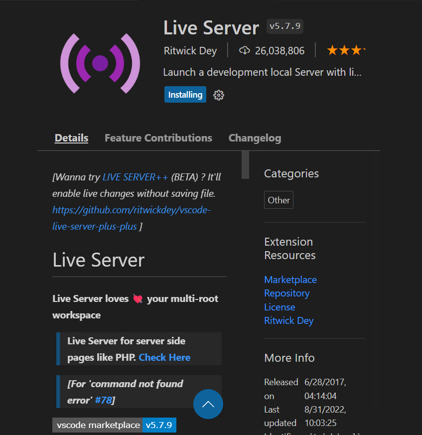
- Klik install
- Tunggu sampai proses instalasi selesai
- Klik kiri pada file HTML yang ingin kita jalankan
- Pilih Open with Live Server
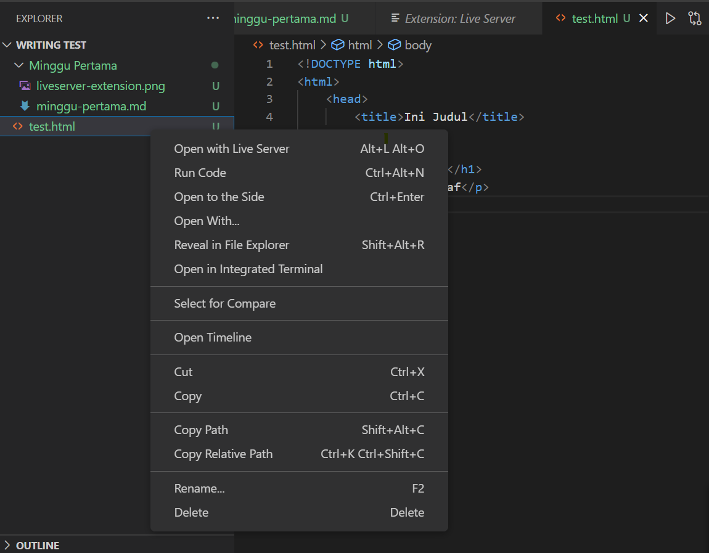
- Tunggu sampai browser terbuka secara otomatis
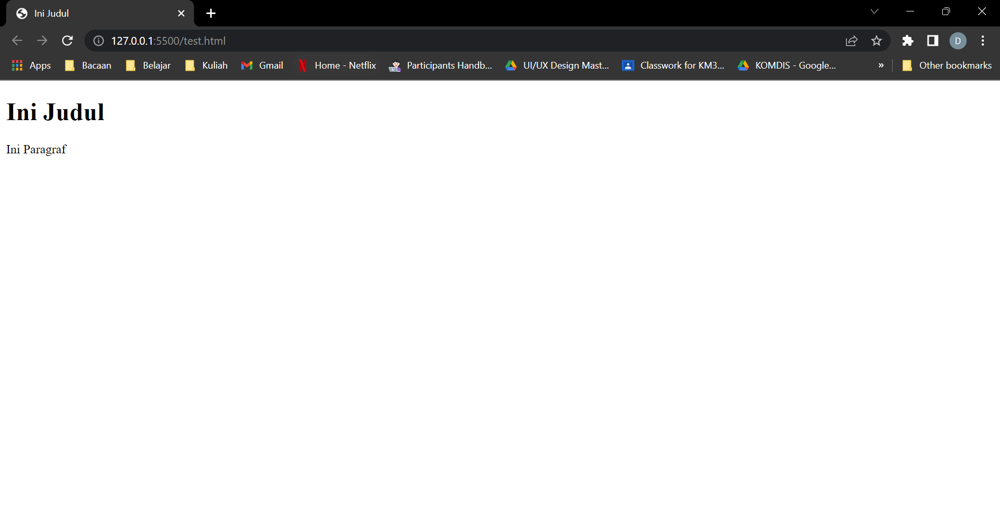

## **Tag HTML**

Tag adalah sebuah tanda pengenal bagi suatu elemen pada HTML. Tag pada HTML dibedakan menjadi 2 jenis, yaitu single tag dan double tag. Single tag adalah tag HTML yang hanya memiliki tag pembuka (<...>) dan tidak memiliki tag penutup. Sedangkan double tag adalah tag HTML yang memiliki tag pembuka dan tag penutup (</...>). Berikut adalah beberapa tag HTML yang sering digunakan:

- Tag \<html> dan \</html>\
    Tag \<html> dan \</html> merupakan tag yang digunakan untuk menandai bahwa file HTML tersebut merupakan file HTML. Tag \<html> merupakan tag pembuka dan tag \</html> merupakan tag penutup.

- Tag \<head> dan \</head>\
    Tag \<head> dan \</head> merupakan tag yang digunakan untuk menandai bahwa bagian tersebut merupakan bagian head. Tag \<head> merupakan tag pembuka dan tag \</head> merupakan tag penutup.

- Tag \<body> dan \</body>\
    Tag \<body> dan \</body> merupakan tag yang digunakan untuk menandai bahwa bagian tersebut merupakan bagian body. Tag \<body> merupakan tag pembuka dan tag \</body> merupakan tag penutup.

- Tag \<title> dan \</title>\
    Tag \<title> dan \</title> merupakan tag yang digunakan untuk menandai bahwa bagian tersebut merupakan bagian judul. Tag \<title> merupakan tag pembuka dan tag \</title> merupakan tag penutup.

- Tag Heading\
    Tag heading merupakan tag yang digunakan untuk menandai bahwa bagian tersebut merupakan bagian heading. Tag heading terdiri dari 6 jenis yaitu h1, h2, h3, h4, h5, dan h6. Semakin besar angka pada tag heading, maka ukuran heading tersebut akan semakin besar. Contoh penggunaan tag heading adalah sebagai berikut:
    ```html
    <h1>Ini Heading 1</h1>
    <h2>Ini Heading 2</h2>
    <h3>Ini Heading 3</h3>
    <h4>Ini Heading 4</h4>
    <h5>Ini Heading 5</h5>
    <h6>Ini Heading 6</h6>
    ```

- Tag Paragraf\
    Tag paragraf merupakan tag yang digunakan untuk menandai bahwa bagian tersebut merupakan bagian paragraf. Tag paragraf ditandai dengan menggunakan tag \<p> dan \</p>. Contoh penggunaan tag paragraf adalah sebagai berikut:
    ```html
    <p>Ini Paragraf</p>
    ```

- Tag Line Break\
    Tag line break merupakan tag yang digunakan untuk menandai bahwa bagian tersebut merupakan bagian line break. Tag line break ditandai dengan menggunakan tag \<br>. Contoh penggunaan tag line break adalah sebagai berikut:
    ```html
    <p>Ini Paragraf<br>Ini Paragraf Baru</p>
    ```

- Tag Image\
    Tag image merupakan tag yang digunakan untuk menandai bahwa bagian tersebut merupakan bagian image. Tag image ditandai dengan menggunakan tag \ dan \</img>. Tag image memiliki atribut src yang digunakan untuk menentukan lokasi gambar. Contoh penggunaan tag image adalah sebagai berikut:
    ```html
    
    ```

- Tag Anchor\
    Tag anchor merupakan tag yang digunakan untuk mengarahkan user ke suatu referensi tertentu. Tag anchor ditandai dengan menggunakan tag \<a> dan \</a>. Tag anchor memiliki atribut href yang digunakan untuk menentukan lokasi tujuan. Contoh penggunaan tag anchor adalah sebagai berikut:
    ```html
    <a href="https://www.skilvul.com/">Skilvul</a>
    ```

- Tag Video\
    Tag video merupakan tag yang digunakan untuk menandai bahwa bagian tersebut merupakan sebuah konten video. Tag video ditandai dengan menggunakan tag \<video> dan \</video>. Tag video memiliki atribut src yang digunakan untuk menentukan lokasi video. Contoh penggunaan tag video adalah sebagai berikut:
    ```html
    <video src="./movie/video1.mp4"></video>
    ```

- Tag List\
    Tag list merupakan tag yang digunakan untuk menandai bahwa bagian tersebut merupakan sebuah list. Tag list terdiri dari 3 jenis yaitu ordered list, unordered list, dan description list. Tag ordered list ditandai dengan menggunakan tag \<ol> dan \</ol>. Tag unordered list ditandai dengan menggunakan tag \<ul> dan \</ul>. Tag description list ditandai dengan menggunakan tag \<dl> dan \</dl>. Contoh penggunaan tag list adalah sebagai berikut:
    ```html
    <ol>
        <li>Item 1</li>
        <li>Item 2</li>
        <li>Item 3</li>
    </ol>
    <ul>
        <li>Item 1</li>
        <li>Item 2</li>
        <li>Item 3</li>
    </ul>
    <dl>
        <dt>Item 1</dt>
        <dd>Deskripsi Item 1</dd>
        <dt>Item 2</dt>
        <dd>Deskripsi Item 2</dd>
        <dt>Item 3</dt>
        <dd>Deskripsi Item 3</dd>
    </dl>
    ```

- Tag Div\
    Tag div merupakan tag yang digunakan untuk menandai bahwa bagian tersebut merupakan sebuah divisi atau suatu bagian dari web yang kita miliki. Tag div ditandai dengan menggunakan tag \<div> dan \</div>. Contoh penggunaan tag div adalah sebagai berikut:
    ```html
    <div>
        <h1>Ini Heading 1</h1>
        <p>Ini Paragraf</p>
    </div>
    ```

- Tag Form\
    Tag form merupakan tag yang digunakan untuk menandai bahwa bagian tersebut merupakan sebuah form. Tag form ditandai dengan menggunakan tag \<form> dan \</form>. Tag form memiliki atribut action yang digunakan untuk menentukan lokasi tujuan ketika form tersebut di submit. Contoh penggunaan tag form adalah sebagai berikut:
    ```html
    <form action="https://www.skilvul.com/">
        <input type="text" placeholder="Nama">
        <input type="text" placeholder="Email">
        <input type="submit" value="Submit">
    </form>
    ```

- Tag Input\
    Tag input merupakan tag yang digunakan untuk menandai bahwa bagian tersebut merupakan sebuah input dari user. Tag input ditandai dengan menggunakan tag \<input> dan \</input>. Tag input memiliki atribut type yang digunakan untuk menentukan tipe input. Contoh penggunaan tag input adalah sebagai berikut:
    ```html
    <input type="text" placeholder="Nama">
    <input type="text" placeholder="Email">
    <input type="submit" value="Submit">
    ```

- Tag Table\
    Tag table merupakan tag yang digunakan untuk menandai bahwa bagian tersebut merupakan sebuah table. Tag table ditandai dengan menggunakan tag \<table> dan \</table>. Tag table memiliki atribut border yang digunakan untuk menentukan border dari table tersebut. Contoh penggunaan tag table adalah sebagai berikut:
    ```html
    <table border="1">
        <tr>
            <th>Nama</th>
            <th>Email</th>
        </tr>
        <tr>
            <td>John Doe</td>
            <td>johndoe@gmail.com</td>
        </tr>
    </table>
<br><br>
## **Semantic Tag**
Semantic Tag merupakan tag yang digunakan untuk memberikan makna tertentu pada bagian tersebut. Contoh tag semantic adalah sebagai berikut:

- Tag Header\
    Tag header merupakan tag yang digunakan untuk menandai bahwa bagian tersebut merupakan sebuah header. Tag header ditandai dengan menggunakan tag \<header> dan \</header>. Contoh penggunaan tag header adalah sebagai berikut:
    ```html
    <header>
        <h1>Ini Heading 1</h1>
        <p>Ini Paragraf</p>
    </header>
    ```

- Tag Footer\
    Tag footer merupakan tag yang digunakan untuk menandai bahwa bagian tersebut merupakan sebuah footer. Tag footer ditandai dengan menggunakan tag \<footer> dan \</footer>. Contoh penggunaan tag footer adalah sebagai berikut:
    ```html
    <footer>
        <h1>Ini Heading 1</h1>
        <p>Ini Paragraf</p>
    </footer>
    ```
- Tag Nav\
    Tag nav merupakan tag yang digunakan untuk menandai bahwa bagian tersebut merupakan sebuah navigation bar. Tag nav ditandai dengan menggunakan tag \<nav> dan \</nav>. Contoh penggunaan tag nav adalah sebagai berikut:
    ```html
    <nav>
        <a href="#">Home</a>
        <a href="#">About</a>
        <a href="#">Contact</a>
    </nav>
    ```
- Tag Section\
    Tag section merupakan tag yang digunakan untuk menandai bahwa bagian tersebut merupakan sebuah section atau suatu bagian dari web yang kita miliki contohnya section perkenalan, about, projek, dan lain sebagainya. Tag section ditandai dengan menggunakan tag \<section> dan \</section>. Contoh penggunaan tag section adalah sebagai berikut:
    ```html
    <section>
        <h1>Ini Heading 1</h1>
        <p>Ini Paragraf</p>
    </section>
    ```

## **Deployment**
Deployment merupakan proses untuk mengupload file-file yang kita miliki ke server. Deployment dapat dilakukan salah satunya dengan cara menggunakan Vercel. Vercel merupakan platform yang digunakan untuk melakukan deployment. Untuk melakukan deployment dengan Vercel, kita dapat mengikuti langkah-langkah berikut:

- Pertama, akses website Vercel dengan mengunjungi link berikut: https://vercel.com/ dan klik tombol login atau signup\
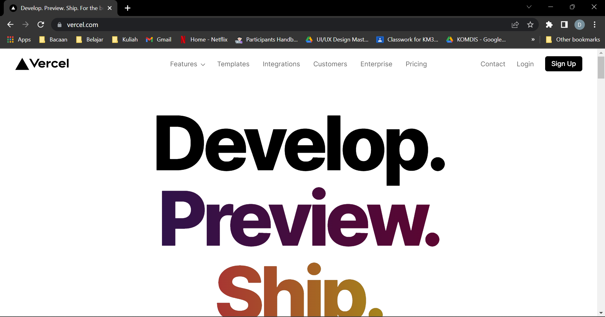

- Pilih metode login atau signup yang diinginkan\
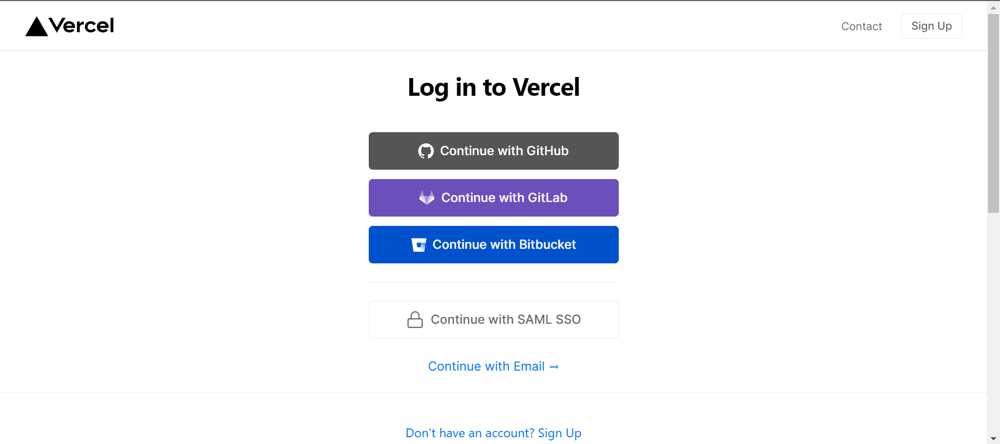

- Setelah login, klik tombol add new dan pilih project\
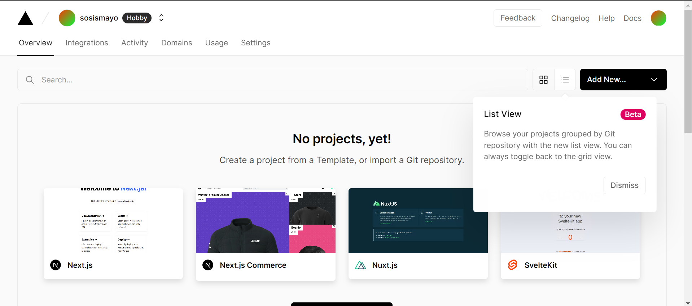

- Pilih metode import project yang akan di deploy dan pilih repositorynya\
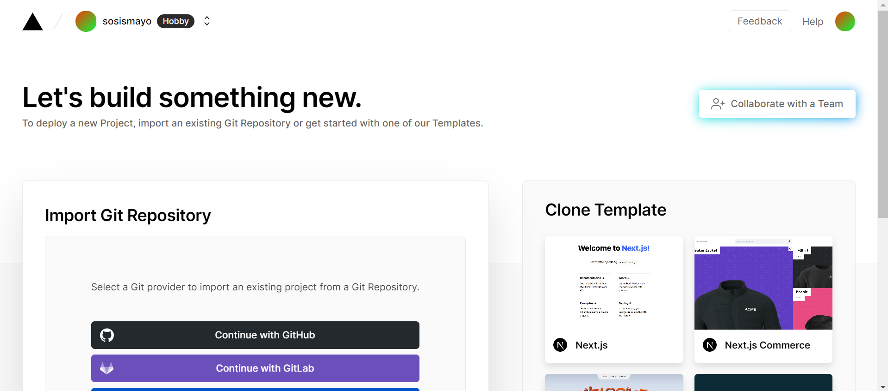

- Setelah itu klik create tim untuk membuat tim jika ingin berkolaborasi\


- Setelah itu, konfigurasikan projek yang akan dibuat klik tombol deploy\
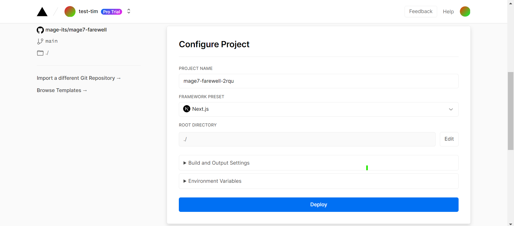

- Tunggu hingga proses deployment selesai dan klik continue to dashboard\
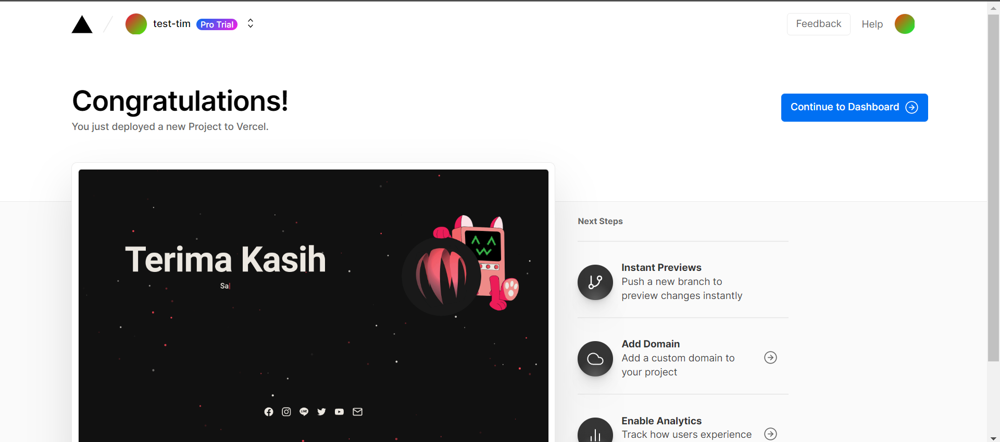

- Untuk mengakses website yang sudah di deploy, klik tombol visit\
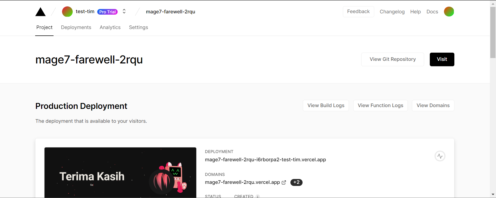
<br><br>

# Dasar CSS

## **CSS**
Setelah tahu mengenai HTML, maka langkah selanjutnya mengetahui apa itu CSS. CSS adalah suatu bahasa untuk melakukan styling dan formating pada halaman website yang kita miliki. CSS digunakan untuk mempercantik tampilan website yang kita miliki. CSS dapat digunakan untuk mengubah warna, ukuran, posisi, dan lain sebagainya. CSS dapat digunakan untuk mengubah tampilan dari tag HTML yang kita miliki.

## **Penggunaan CSS**
Untuk menggunakan CSS, kita dapat menggunakan 3 cara yaitu inline, internal, dan external. Cara-cara tersebut akan dijelaskan pada bagian berikut.

- Inline\
    Inline merupakan cara untuk menggunakan CSS dengan menambahkan style pada tag HTML. Contoh penggunaan inline adalah sebagai berikut:
    ```css
    <h1 style="color: red;">Ini Heading 1</h1>
    ```

- Internal\
    Internal merupakan cara untuk menggunakan CSS dengan menambahkan tag style pada bagian head HTML. Contoh penggunaan internal adalah sebagai berikut:
    ```css
    <style>
        h1 {
            color: red;
        }
    </style>
    ```

- External\
    External merupakan cara untuk menggunakan CSS dengan menambahkan tag link pada bagian head HTML. Contoh penggunaan external adalah sebagai berikut:
    ```css
    <link rel="stylesheet" href="style.css">
    ```
    <br>

## **CSS Syntax**

CSS memiliki syntax yang berbeda dengan HTML. Syntax CSS terdiri dari selector dan declaration. Selector merupakan bagian yang digunakan untuk memilih tag HTML yang akan di styling. Sedangkan declaration merupakan bagian yang digunakan untuk menentukan style yang akan diberikan pada tag HTML yang dipilih. Declaration sendiri terdiri dari property dan value. Property adalah bagian style yang ingin kita ubah, dan value adalah nilainya. Syntax CSS dapat dilihat pada gambar berikut:\
<br>
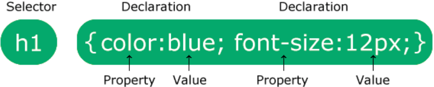
> Sumber : https://www.w3schools.com/css/img_selector.gif

<br>

## **CSS Selector**
CSS Selector merupakan bagian yang digunakan untuk memilih tag HTML yang akan di styling. CSS Selector dapat digunakan untuk memilih tag HTML yang kita miliki. Berikut adalah beberapa jenis CSS Selector yang dapat digunakan:

- Selector Element\
    Selector element merupakan selector yang digunakan untuk memilih tag HTML berdasarkan nama tagnya. Contoh penggunaan selector element adalah sebagai berikut:
    ```css
    h1 {
        color: red;
    }
    ```

- Selector ID\
    Selector ID merupakan selector yang digunakan untuk memilih tag HTML berdasarkan ID yang dimiliki. ID merupakan atribut yang dimiliki oleh tag HTML. ID dapat digunakan untuk membedakan tag HTML yang sama. Contoh penggunaan selector ID adalah sebagai berikut:
    ```css
    #id {
        color: red;
    }
    ```

- Selector Class\
    Selector class merupakan selector yang digunakan untuk memilih tag HTML berdasarkan class yang dimiliki. Class merupakan atribut yang dimiliki oleh tag HTML. Class dapat digunakan untuk membedakan tag HTML yang sama. Contoh penggunaan selector class adalah sebagai berikut:
    ```css
    .class {
        color: red;
    }
    ```

- Selector Descendant\
    Selector descendant merupakan selector yang digunakan untuk memilih tag HTML berdasarkan tag HTML yang berada di dalam tag HTML lain. Contoh penggunaan selector descendant adalah sebagai berikut:
    ```css
    h1 span {
        color: red;
    }
    ```

- Selector Child\
    Selector child merupakan selector yang digunakan untuk memilih tag HTML berdasarkan tag HTML yang berada di dalam tag HTML lain. Perbedaan dengan selector descendant adalah selector child hanya akan memilih tag HTML yang berada di dalam tag HTML lain yang berada di level yang sama. Contoh penggunaan selector child adalah sebagai berikut:
    ```css
    h1 > span {
        color: red;
    }
    ```
<br>

# CSS Flexbox
Flexbox merupakan suatu metode untuk mengatur layout pada CSS. Flexbox merupakan salah satu metode yang direkomendasikan karena lebih mudah digunakan dan lebih fleksibel. Flexbox dapat digunakan untuk mengatur layout secara horizontal maupun vertical. Flexbox dapat digunakan untuk mengatur layout pada tag HTML yang memiliki banyak child tag HTML. Flexbox dapat digunakan untuk mengatur posisi, ukuran, dan lain sebagainya. Konsep dari Flexbox adalah suatu container yang memiliki banyak child tag HTML. Container tersebut akan membagi ruang yang dimiliki sesuai dengan ukuran child tag HTML yang dimiliki.

## **Ordering dan Orientation**

- flex-direction\
    flex-direction merupakan property yang digunakan untuk mengatur orientation dari flexbox. flex-direction memiliki 4 value yaitu :
    - row\
    Value row merupakan orientation dari flexbox yang horizontal dari kiri ke kanan.
    - row-reverse\
    Value row-reverse merupakan orientation dari flexbox yang horizontal dari kanan ke kiri.
    - column\
    Value column merupakan orientation dari flexbox yang vertical dari atas ke bawah.
    - column-reverse\
    Value column-reverse merupakan orientation dari flexbox yang vertical dari bawah ke atas.
- flex-wrap\
    flex-wrap merupakan property yang digunakan untuk mengatur apakah child tag HTML akan dibagi menjadi beberapa baris atau tidak. flex-wrap memiliki 2 value yaitu :
    - nowrap\
    Value nowrap merupakan value yang digunakan untuk mengatur agar child tag HTML tidak dibagi menjadi beberapa baris.
    - wrap\
    Value wrap merupakan value yang digunakan untuk mengatur agar child tag HTML dibagi menjadi beberapa baris.
    - wrap-reverse\
    Value wrap-reverse merupakan value yang digunakan untuk mengatur agar child tag HTML dibagi menjadi beberapa baris dengan urutan baris yang terbalik.
- flex-flow\
    flex-flow merupakan property yang digunakan untuk mengatur flex-direction dan flex-wrap secara bersamaan.
- order\
    order merupakan property yang digunakan untuk mengatur urutan dari child tag HTML. order memiliki value berupa integer 0, 1 atau -1. Value 0 merupakan value default dari order. Value -1 merupakan value yang digunakan untuk mengatur urutan child tag HTML menjadi lebih dulu. Value 1 merupakan value yang digunakan untuk mengatur urutan child tag HTML menjadi lebih terakhir.

## **Allignment**

- justify-content\
justify-content merupakan property yang digunakan untuk mengatur posisi dari child tag HTML secara horizontal. justify-content memiliki 6 value yaitu :
    - flex-start\
    flex-start merupakan value yang digunakan untuk mengatur posisi child tag HTML menjadi rata kiri.
    - flex-end\
    flex-end merupakan value yang digunakan untuk mengatur posisi child tag HTML menjadi rata kanan.
    - center\
    center merupakan value yang digunakan untuk mengatur posisi child tag HTML menjadi rata tengah.
    - space-between\
    space-between merupakan value yang digunakan untuk mengatur posisi child tag HTML menjadi rata kanan kiri dengan jarak yang sama antar child tag HTML.
    - space-around\
    space-around merupakan value yang digunakan untuk mengatur posisi child tag HTML sehingga jarak antar item sama, dan jarak item terluar dengan containernya adalah sama.
    - space-evenly\
    space-evenly merupakan value yang digunakan untuk mengatur posisi child tag HTML sehingga jarak antar item maupun jarak item terluar dengan containernya adalah sama.
- align-items\
align-items merupakan property yang digunakan untuk mengatur posisi dari child tag HTML secara vertical. align-items memiliki 6 value yaitu :
    - flex-start\
    flex-start merupakan value yang digunakan untuk mengatur posisi child tag HTML menjadi rata atas.
    - flex-end\
    flex-end merupakan value yang digunakan untuk mengatur posisi child tag HTML menjadi rata bawah.
    - center\
    center merupakan value yang digunakan untuk mengatur posisi child tag HTML menjadi rata tengah.
    - baseline\
    baseline merupakan value yang digunakan untuk mengatur posisi child tag HTML menjadi rata dengan baseline.
    - stretch\
    stretch merupakan value yang digunakan untuk mengatur posisi child tag HTML menjadi rata dengan ukuran container.
- align-content\
align-content digunakan untuk mengatur tata letak dan space antar item child secara vertikal atau cross axis. align-content memiliki value yang sama dengan justify-content, namun dengan 1 value tambahan yaitu :
    - stretch\
    stretch merupakan value yang digunakan untuk mengatur posisi child tag HTML menjadi rata dengan ukuran container.
- align-self\
align-self merupakan property yang digunakan untuk mengatur align item pada masing-masing item. align-self memiliki value yang sama dengan align-items.

## **Flexibility**
 - flex-grow\
flex-grow merupakan property yang digunakan untuk mengatur ukuran dari child tag HTML. flex-grow memiliki value berupa integer. Value 0 merupakan value default dari flex-grow. Semakin besar nilai value flex-grow maka akan semakin besar item tersebut relatif terhadap item lainnya.

- flex-shrink\
flex-shrink merupakan property yang digunakan untuk mengatur ukuran dari child tag HTML. flex-shrink memiliki value berupa integer. Value 0 merupakan value default dari flex-shrink. Semakin besar nilai value flex-shrink maka akan semakin besar item tersebut relatif terhadap item lainnya.

- flex-basis\
flex-basis merupakan property yang digunakan untuk mengatur ukuran dari child tag HTML. flex-basis berfungsi layaknya width.
<br>
<br>

# Algoritma dan Struktur Data

## **Algoritma**
Algoritma dapat diartikan sebagai suatu langkah-langkah yang sistematis untuk menyelesaikan sebuah masalah. Proses-proses yang ada dalam suatu algoritma haruslah logis dan sistematis. Contohnya ketika kita ingin membuat kopi, maka langkah-langkah yang kita lakukan adalah sebagai berikut :
- Ambil teko
- Isi teko dengan air
- Letakkan teko di atas kompor
- Nyalakan kompor
- Tunggu air mendidih
- Ambil gelas
- Masukkan kopi ke dalam gelas
- Tuangkan air yang sudah mendidih ke dalam gelas
- Aduk kopi hingga merata

## **Manfaat Algoritma**
Pemrograman pada dasarnya adalah menyelesaikan suatu permasalahan, sehingga algoritma merupakan salah satu hal yang utama dalam pemrograman, sedangkan bahasa pemrograman hanyalah alat bagi kita untuk menerapkan algoritma.

## **Ciri-Ciri Algoritma**
Algoritma memiliki ciri-ciri tersendiri, diantaranya adalah :
- Memiliki setidaknya satu output.
- Instruksi yang dilakukan jelas (tidak ambigu)
- Memiliki akhir (Finite)
- Efisien dan tepat sasaran (Efektif)

## **Jenis-Jenis Proses Dalam Algoritma**
- Sequence\
Sequence merupakan proses yang dilakukan secara berurutan.
- Selection\
Selection merupakan proses yang dilakukan untuk memilih percabangan dalam suatu algoritma.
- Iteration\
Iteration merupakan proses yang dilakukan secara berulang-ulang.
- Concurrent\
Concurrent merupakan proses yang dilakukan secara bersamaan (paralel).

## **Penyajian Algoritma**
Algoritma dapat disajikan dalam beberapa bentuk, diantaranya adalah :
- Deskripsi\
Kita dapat menyajikan algoritma dalam bentuk deskripsi, yaitu dengan menggunakan bahasa sehari-hari layaknya kita sedang menjelaskan suatu proses.
- Flowchart\
Flowchart merupakan bentuk penyajian algoritma yang paling umum digunakan. Flowchart merupakan suatu diagram yang berisi simbol-simbol yang digunakan untuk menggambarkan proses-proses dalam suatu algoritma.
- Pseudocode\
Pseudocode (kode-semu) merupakan bentuk penyajian algoritma yang menggunakan bahasa pemrograman yang sederhana. Pseudocode merupakan gabungan antara bahasa pemrograman dan bahasa sehari-hari.

## **Struktur Data**
Dikarenakan ciri-ciri algoritma yang harus efisien dan efektif, maka struktur data merupakan salah satu hal yang penting dalam algoritma. Struktur data merupakan suatu cara untuk menyimpan data dalam memori komputer. Struktur data juga merupakan cara untuk mengelompokkan data yang memiliki hubungan satu sama lain.
Sehingga algoritma dan struktur data haruslah berjalan bersamaan. Secara sederhana, algoritma merupakan langkah-langkah yang dilakukan, sedangkan struktur data merupakan cara menyimpan data agar algoritma kita bisa berjalan secara efektif dan efisien 

## **Contoh Penerapan Algoritma**
Untuk lebih memahami algoritma dan dapat menerapkannya ke dalam bahasa pemrograman, berikut ini adalah contoh penerapan algoritma dalam bahasa pemrograman. Misalkan kita memiliki permasalahan untuk menghitung suatu luas persegi. Maka jika kita menuliskan algoritmanya secara deskriptif, akan menjadi seperti berikut :
- Masukkan panjang sisi persegi
- Kalikan panjang sisi persegi dengan panjang sisi persegi
- Luas persegi adalah hasil perkalian tersebut.

Jika kita tuliskan dalam bahasa pemrograman javascript, maka akan menjadi seperti berikut :
```javascript
let sisi = 5;
let luas = sisi * sisi;
console.log(luas);
```
<br>
<br>

# Javascript Dasar

## **Apa Itu Javascript**
Menurut Wikipedia, Javascript adalah bahasa pemrograman tingkat tinggi dan dinamis yang dapat berjalan di dalam browser pengguna. Javascript dapat berjalan di dalam browser pengguna karena Javascript merupakan bahasa pemrograman yang bersifat client-side.Namun kini javascript juga dapat berjalan diluar web-browser berkat adanya Node.JS. Javascript juga merupakan bahasa pemrograman yang bersifat object-oriented. Javascript juga memiliki sifat case-sensitive, artinya huruf besar dan huruf kecil berbeda.
Dalam konteks web development, javascript biasa digunakan untuk membuat website menjadi lebih interaktif. Javascript juga dapat digunakan untuk membuat website menjadi lebih dinamis, seperti membuat website menjadi responsive, menambah animasi, dan lain sebagainya

## **Menjalankan Javascript**
Untuk menjalankan javascript dapat dilakukan dengan beberapa cara, diantaranya adalah :
- Console Browser\
Javascript dapat dijalankan melalui console browser. Untuk membuka console browser, dapat dilakukan dengan menekan tombol F12 pada keyboard, lalu pilih tab console.
- Node.JS\
Node.JS adalah runtime environment untuk javascript. Node.JS dapat digunakan untuk menjalankan javascript diluar web-browser. Untuk menjalankan javascript menggunakan Node.JS, pertama-tama kita harus menginstall Node.JS terlebih dahulu. Setelah itu, buka terminal, lalu ketikkan perintah berikut :

    ```
    node nama_file.js
    ```
## **Variabel*
Variabel merupakan suatu tempat untuk kita menyimpan sebuah data. Untuk membuat variabel, dalam javascript kita dapat gunakan beberapa cara, yaitu :

- var\
Untuk membuat variabel menggunakan var, kita dapat menuliskan seperti berikut :

    ```javascript
    var variabel1;
    ```
- let\
Untuk membuat variabel menggunakan let, kita dapat menuliskan seperti berikut :
    ```javascript
    let variabel2;
    ```
- const\
Untuk membuat variabel menggunakan const, kita dapat menuliskan seperti berikut :
    ```javascript
    const variabel3;
    ```
Ketiga cara diatas sama-sama digunakan untuk membuat variabel. Perbedaannya adalah ketika kita menggunakan const, maka variabel tersebut tidak dapat diubah nilainya. Sedangkan ketika kita menggunakan var atau let, maka variabel tersebut dapat diubah nilainya. Beberapa perbedaan antara var dan let yaitu jika suatu variabel didekalarasikan menggunakan var, maka kita bisa mendeklarasikan variabel dengan nama yang sama, sedangkan jika menggunakan let, maka kita tidak bisa mendeklarasikan variabel dengan nama yang sama. Variabel yang dideklarasikan dengan var akan menghasilkan nilai undefined jika dipanggil sebelum didefinisikan, namun variabel yang dideklarasikan dengan menggunakan let akan menghasilkan error jika dipanggil sebelum didefinisikan. 
<br>
<br>

## **Tipe Data**
Javascript memiliki beberapa tipe data, diantaranya adalah :
- Number\
Number adalah tipe data yang digunakan untuk menyimpan angka. Untuk mengecek tipe data dari suatu variabel, kita dapat menggunakan perintah typeof. Contoh :

    ```javascript
    let angka = 10;
    console.log(typeof(angka));
    ```
- String\
String adalah tipe data yang digunakan untuk menyimpan karakter maupun teks. Contoh :

    ```javascript
    let teks = "ini adalah teks";
    console.log(typeof(teks));
    ```

- Boolean\
Boolean adalah tipe data yang digunakan untuk menyimpan nilai true atau false. Contoh :

    ```javascript
    let benar = true;
    console.log(typeof(benar));
    ```

- Array\
Array adalah tipe data yang digunakan untuk menyimpan kumpulan data, baik yang bertipe sama maupun berbeda. Contoh :

    ```javascript
    let array = [1,2,3,4,5];
    console.log(typeof(array));
    ```

- Object\
Object adalah tipe data yang digunakan untuk menyimpan kumpulan data yang memiliki key dan value. Contoh :

    ```javascript
    let object = {
        nama : "John Doe",
        umur : 20
    }
    console.log(typeof(object));
    ```

- Undefined\
Undefined adalah tipe data yang digunakan untuk menyimpan nilai kosong (belum didefinisikan). Contoh :

    ```javascript
    let kosong;
    console.log(typeof(kosong));
    ```

- Null
Null adalah tipe data yang digunakan untuk menyimpan nilai kosong (tidak ada nilai). Contoh :

    ```javascript
    let kosong = null;
    console.log(typeof(kosong));
    ```

## **Operator**
Ada beberapa operator yang bisa digunakan di javascript, antara lain :
- Assignment\
Assignment operator adalah sebuah operator yang digunakan untuk mengisi nilai ke dalam variabel. Contoh :

    ```javascript
    let angka = 10;
    ```
- Mathematical Assignment\
Mathematical Assigment adalah operator yang digunakan untuk melakukan operasi matematika pada variabel sekaligus mengisi nilai variabel tersebut dengan hasil operasi matematikanya. Contoh :

    ```javascript
    let angka = 10;
    angka += 10;
    // Sama saja dengan angka = angka + 10
    console.log(angka);
    ```
- Increment dan Decrement
Increment dan decrement adalah operator yang digunakan untuk menambah atau mengurangi nilai variabel sebanyak 1. Contoh :

    ```javascript
    let angka = 10;
    angka++;
    // Sama saja dengan angka = angka + 1
    console.log(angka);
    ```

- Aritmathic
Aritmathic adalah operator yang digunakan untuk melakukan operasi matematika pada variabel. Contoh :

    ```javascript
    let angka1 = 10;
    let angka2 = 5;
    let kali = angka1 * angka2;
    console.log(kali);
    ```
- Comparison
Comparison adalah operator yang digunakan untuk membandingkan dua buah nilai dan akan menghasilkan nilai boolean. Contoh :

    ```javascript
    let angka1 = 10;
    let angka2 = 5;
    let hasil = angka1 < angka2;
    // hasil akan bernilai false karena 10 tidak lebih kecil dari 5
    console.log(hasil);
    ```

- Logical
Logical adalah operator yang digunakan untuk melakukan operasi logika () pada variabel. Contoh :

    ```javascript
    let angka1 = 10;
    let angka2 = 5;
    let hasilAnd = angka1 > angka2 && angka1 < 0;
    let hasilOr = angka1 > angka2 || angka1 < 0;
    // hasilAnd akan bernilai false karena 10 lebih besar dari 5 dan 10 tidak lebih kecil dari 0
    // hasilOr akan bernilai true karena 10 lebih besar dari 5 atau 10 lebih kecil dari 0
    console.log(hasilAnd);
    console.log(hasilOr);
    ```

## **Percabangan**
Dalam javascript, kita dapat menggunakan percabangan untuk mengeksekusi suatu kode jika kondisi tertentu terpenuhi. Ada beberapa jenis percabangan yang bisa digunakan di javascript, antara lain :

- If\
If adalah percabangan yang digunakan untuk mengeksekusi suatu kode jika kondisi yang ditentukan terpenuhi. Contoh :

    ```javascript
    let angka = 10;
    if(angka > 5){
        console.log("Angka lebih besar dari 5");
    }
    ```

- If..Else\
If else adalah percabangan yang digunakan untuk mengeksekusi suatu kode jika kondisi yang ditentukan terpenuhi, dan jika kondisi tersebut tidak terpenuhi, maka akan mengeksekusi kode yang ada di dalam else. Contoh :

    ```javascript
    let angka = 10;
    if(angka > 5){
        console.log("Angka lebih besar dari 5");
    }else{
        console.log("Angka lebih kecil dari 5");
    }
    ```

- If..Else If\
If else if adalah percabangan yang digunakan untuk mengeksekusi suatu kode jika kondisi yang ditentukan pada blok if terpenuhi, namun jika kondisi dalam if tidak terpenuhi maka akan dicari pada else if berikutnya. Contoh :

    ```javascript
    let angka = 10;
    if(angka > 5){
        console.log("Angka lebih besar dari 5");
    }else if(angka < 5){
        console.log("Angka lebih kecil dari 5");
    }else{
        console.log("Angka sama dengan 5");
    }
    ```
- Switch-Case\
Switch-case adalah percabangan yang dilakukan dengan memilih berdasarkan dari nilai suatu parameter yang telah ditentukan. Contoh :

    ```javascript
    let angka = 10;
    switch(angka){
    // Parameter yang digunakan untuk memilih adalah nilai angka
        case 10:
            console.log("Angka sama dengan 10");
            break;
        case 5:
            console.log("Angka sama dengan 5");
            break;
        default:
            console.log("Angka tidak sama dengan 10 dan 5");
    }
    ```

## **Perulangan**
Dalam javascript, terdapat beberapa perintah yang dapat digunakan untuk melakukan perulangan. Perulangan dapat digunakan untuk mengeksekusi suatu kode secara berulang-ulang. Ada beberapa jenis perulangan yang bisa digunakan di javascript, antara lain :

- For\
For adalah perulangan yang digunakan untuk mengeksekusi suatu kode secara berulang-ulang dengan jumlah perulangan yang sudah ditentukan. Contoh :

    ```javascript
    for(let i = 0; i < 10; i++){
        console.log(i);
    }
    ```

- While\
While adalah perulangan yang digunakan untuk mengeksekusi suatu kode secara berulang-ulang selama kondisi yang ditentukan terpenuhi. Contoh :

    ```javascript
    let i = 0;
    while(i < 10){
        console.log(i);
        i++;
    }
    ```
- Do..While\
Do..While adalah perulangan yang digunakan untuk mengeksekusi suatu kode secara berulang-ulang selama kondisi yang ditentukan terpenuhi. Perbedaannya dengan while adalah, kode yang ada di dalam do akan dijalankan terlebih dahulu, baru kemudian akan dicek kondisinya. Sehingga perulangan akan dilakukan setidaknya satu kali. Contoh :

    ```javascript
    let i = 0;
    do{
        console.log(i);
        i++;
    }while(i > 10);
    // Maka Outputnya akan 0
    while(i > 10){
        console.log(i);
        i++;
    }
    // Maka tidak akan ada output
    ```


